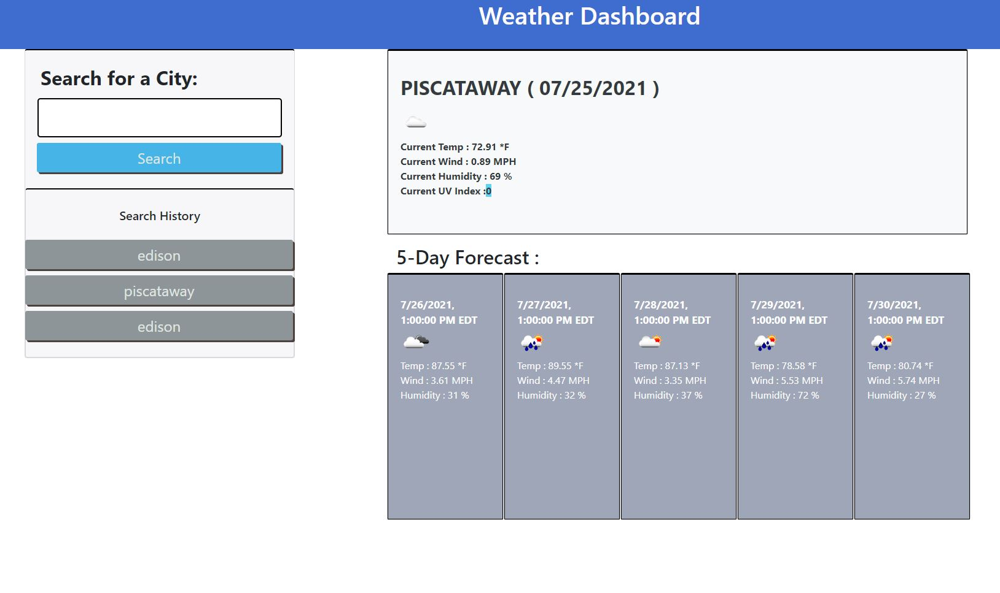

### weather-dashboard

Client requested to create Weather Dashboard that can search by City. 

* Minimum requirements from the clients are as follow  : 

1.  When you search for a city, it presents current and future weather conditions 
1.  Upon searching the city name gets added in search history
1.  When checking current condition for the city, it shows city name, current date, icon representation of current weather, temperature,
    wind speed, humidity and UV Index.
1.  The UV Index will have background color indicating favorable(blue color), moderate (yellowish color) or severe ( red color) level 
1.  It presents next 5 days forecast that displays date, icon representation, temperature, wind speed and humidity
1.  When clicking back on a city in search history, it will reload with current and future conditions for that city

## Below is the screenshot and Deployed application of the Project as per client request ## 

[Please click here to deploy application](https://miraj00.github.io/weather-dashboard/)

